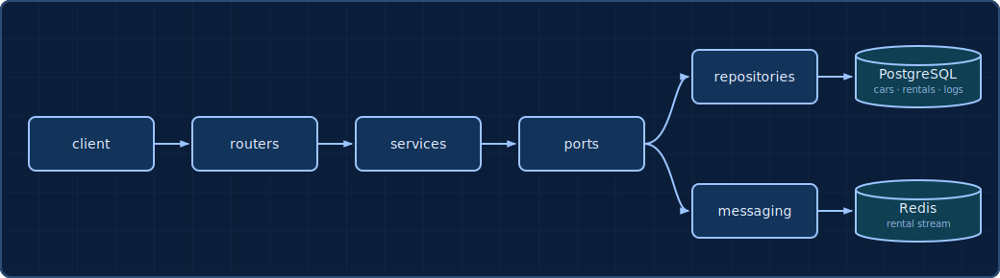

# Hornet

[](LICENSE) [](https://github.com/klaiderman/hornet)

Hornet is a small internal REST API for managing a car-rental fleet - add, update and delete cars, register and end rentals, and keep track of whether each car is `available`, `in_use`, or `under_maintenance`.

The name is a nod to the **Hornet**, the signature stock car from [Sega's arcade classic *Daytona USA* (1993)](https://en.wikipedia.org/wiki/Daytona_USA).

## Contents

- [Architecture](#architecture)
- [Data store](#data-store)
- [Run](#run)
- [Using the API](#using-the-api)
- [API docs and health](#api-docs-and-health)
- [Roadmap](#roadmap)

## Architecture

<p align="center">
  
</p>

It's a layered setup: `routers` handle HTTP, `services` hold the business logic and only talk to `ports` (protocols), and the SQL and Redis adapters implement those ports and get wired in at startup. That way the web layer and the database never touch each other directly.

```
hornet/
├── .github/
│   └── workflows/
├── docs/
├── migrations/
│   └── versions/
├── scripts/
├── src/
│   └── hornet/
│       ├── commands/
│       ├── core/
│       ├── decorators/
│       ├── dependencies/
│       ├── entities/
│       ├── events/
│       ├── exceptions/
│       ├── helpers/
│       ├── messaging/
│       ├── models/
│       ├── ports/
│       ├── repositories/
│       ├── routers/
│       ├── schemas/
│       └── services/
└── tests/
    ├── factories/
    ├── integration/
    └── unit/
        └── fakes/
```

## Data store

I went with **PostgreSQL**. The data is relational - a rental points at a car - and one rule really drove the choice: a car can only have one open rental at a time. Postgres lets me put that straight in the schema as a partial unique index, `UNIQUE (car_id) WHERE end_date IS NULL`, so if two rentals for the same car land at once the database rejects the second one instead of trusting the app to win the race. SQLAlchemy plus Alembic made it the path of least resistance.

Why not the others:

- **MySQL** - no partial indexes, so that one-open-rental rule can't live in the schema; you'd be back to enforcing it in application code and hoping it holds under load.
- **MongoDB** - it does have partial-filter unique indexes, but they sit outside multi-document transactions, and the data is relational anyway (rentals reference cars), so a document model works against the grain.
- **SQLite** - great for tests and quick local runs, but its single-writer locking isn't built for concurrent writes from an API.

## Run

```bash
docker compose up --build
```

The API comes up on port 8000. To run it locally instead, with [uv](https://github.com/astral-sh/uv):

```bash
uv sync && uv run alembic upgrade head && uv run uvicorn hornet.main:app --reload
```

## Using the API

Every response comes back in a small [`ApiResponse`](src/hornet/schemas/api_response.py) envelope, and failures carry an [`ApiError`](src/hornet/schemas/api_error.py). Here's a full run through the fleet - add a couple of cars, rent one out, and close it back up.

```bash
# add two cars
curl -X POST localhost:8000/cars -H 'Content-Type: application/json' \
  -d '{"model": "Hornet", "year": 1993}'
curl -X POST localhost:8000/cars -H 'Content-Type: application/json' \
  -d '{"model": "Beetle", "year": 2001}'

# list the fleet, or just the available ones
curl localhost:8000/cars
curl "localhost:8000/cars?status=available"

# send the Beetle in for maintenance
curl -X PATCH localhost:8000/cars/2 -H 'Content-Type: application/json' \
  -d '{"status": "under_maintenance"}'

# rent out car 1 - it flips to in_use
curl -X POST localhost:8000/rentals -H 'Content-Type: application/json' \
  -d '{"car_id": 1, "customer_name": "Israel Israeli", "start_date": "2026-07-01"}'

# check the open rentals
curl "localhost:8000/rentals?open_only=true"

# bring car 1 back - the rental closes and the car frees up
curl -X POST localhost:8000/rentals/1/end

# retire the Beetle (a car with no rentals can be deleted)
curl -X DELETE localhost:8000/cars/2
```

## API docs and health

FastAPI gives you interactive docs for free:

- Swagger UI at `http://localhost:8000/docs`
- ReDoc at `http://localhost:8000/redoc`
- OpenAPI schema at `http://localhost:8000/openapi.json`

Operational endpoints:

- `GET /healthz` - readiness check, pings the database
- `GET /metrics` - Prometheus counters for active cars, ongoing rentals, and request latency

Logging goes through the standard library `logging` module to the console and a rotating file, covering the important actions (adding, updating and deleting cars, starting and ending rentals) plus errors.

## Roadmap

Things I'd reach for with more time, roughly in order:

- **Authentication and authorization** - a real identity layer (API keys backed by a store, or OAuth / JWT) with per-caller scopes, instead of an open internal API.
- **More middleware** - request IDs and correlation, structured request/response logging, CORS, and sensible timeouts.
- **Idempotency** - an `Idempotency-Key` on `POST /rentals` so a retried request can't register the same rental twice.
- **Richer querying** - filtering, sorting and cursor-based pagination on the list endpoints, beyond the current status filter.
- **Deeper observability** - structured JSON logs and OpenTelemetry tracing across the request path.
- **Transactional outbox** - publish rental events through an outbox table so a Redis hiccup can't silently drop them.
